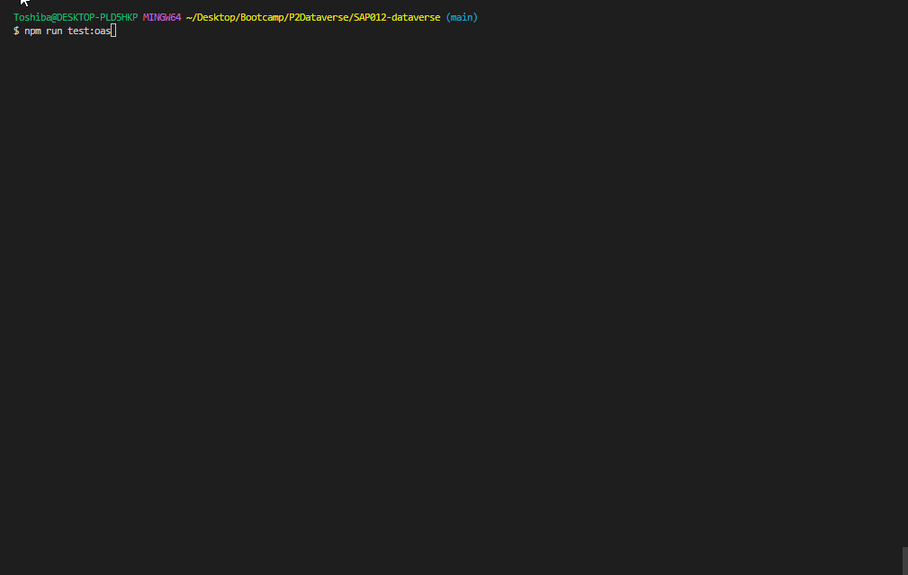
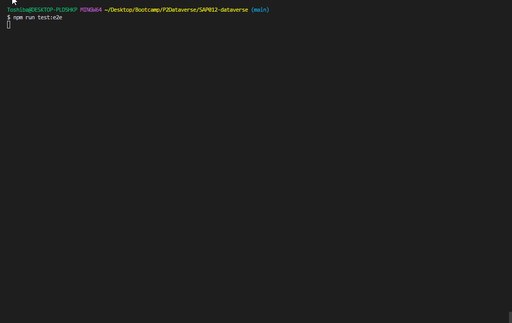

## Índice

* [1. Resumo do projeto](#1-resumo-do-projeto)
* [2. Ferramentas utilizadas](#2-ferramentas-utilizadas)
* [3. Funcionalidades](#3-funcionalidades)
* [4. Boilerplate](#4-Boilerplate)
* [5. Tarefas](#5-tarefas)
* [6. Testes](#6-testes)
* [7. Objetivos de Aprendizagem](#7-objetivos-de-aprendizagem)
* [8. Considerações Finais](#8-considerações-finais)

***

## 1. Resumo do projeto

Atualmente há uma grande quantidade de dados produzidos, no entanto, os dados por si só têm pouca utilidade. Para que essas grandes
quantidades de dados se transformem em **informação** fácil de ler para
as usuárias, precisamos entender e processar esses dados. Uma maneira
simples de fazer isso é criando _interfaces_ e _visualizações_.

Neste projeto, foi **construído um _site_ para visualizar um
_conjunto de dados_**. Para isso foi utilizado a ferramenta de inteligência artificial, o **ChatGPT**, para gerar um banco de dados em um arquivo javascript, através do [prompting](https://chat.openai.com/share/ba46b56e-6b79-4fec-8b45-3b6c8f2aa134).

Como entrega final, oferecemos um site responsivo que permite **visualizar os dados, filtrá-los, ordená-los e calcular estatísticas**, sendo esses dados relacionados a carreiras de tecnologia. 

- Este projeto foi realizado em dupla por Camila Lara e Fabine Specian, com apoio da equipe e das colegas do Bootcamp de Desenvolvimento Front-end da **Laboratória**.
- O principal objetivo desse projeto é a aprendizagem e o desenvolvimento de habilidades técnicas e softskills.
- Não foi permitido o uso de frameworks de CSS (Bootstrap, Materialize, etc).
- O tempo de conclusão do projeto foi de 6 Sprints.
- O projeto foi publicado no [GitHub Pages](link do deploy).

## 2. Ferramentas utilizadas

### Preparo do PC para trabalhar

+ Node.js
+ Git e GitBash
+ Playwright
+ Visual Studio Code

### Organização e planejamento

+ GitHub

+ Trello: [Dataverse](https://trello.com/b/h0sqGTYj/dataverse)

+ Notion: [Dataverse](https://brawny-coyote-859.notion.site/DATAVERSE-288dc371330d4347a2cdaecd93702fc2)

### Linguagens

+ HTML

+ CSS

+ Vanilla JavaScript

## Geração de dados

+ ChatGPT

## Geração de imagens

+ Bing

## Prototipagem

+ Canva

+ Figma

## 3. Funcionalidades

Aqui estão definidas com mais detalhes as funcionalidades que foram implementadas:

* A aplicação permite que a usuária veja os itens dos dados em uma visualização, em estilo de cartões.

* Os 24 cartões contém dados que a usuária deseja ver referentes às carreiras de tecnologia: imagem, nome da profissão, descrição da profissão, formação sugerida, tech skills, soft skills e média salarial.

* A aplicação permite à usuária filtrar os dados por formação sugerida, apresentando 15 opções de graduações.

* A aplicação calcula e exibe uma estatística dos dados.

* A aplicação permite à usuária ordenar os dados. Por média salarial, é possível ordenar de forma ascendente e descendente. 
  
* As funcionalidades de ordenação operam sobre os dados filtrados. Por exemplo, se filtrar as profissões por formação sugerida e escolher Ciência da Comnputação, na sequência orderna por média salarial (ascendente, ou descendente) os cartões das profissões relacionadas a Ciência da Computação.

* A aplicação permite à usuária reiniciar a aplicação, limpando
  filtros e ordenamentos, com um botão "Limpar".

* As operações de filtrar, ordenar, limpar, não recarregam a página, mas sim adicionam conteúdo de maneira dinâmica via JavaScript.

* A aplicação é _responsiva_, ou seja, pode ser visualizada sem problemas
  em diferentes tamanhos de tela: celulares, tablets e desktops.


## 4. Boilerplate

A lógica deste projeto foi implementada em javascript. Não foi permitido o uso de bibliotecas e frameworks, apenas JavaScript puro, também conhecido como Vanilla Javascript.
Para começar este projeto, foi feito -fork_ e clone de um repositório da **Laboratória**, a partir do qual foi fornecida a estrutura básica com arquivos e configuração inicial de dependêncuas e testes, o _boilerplate_.
O _boilerplate_ continha a seguinte estrutura:

```text
.
├── README.md
├── package.json
├── src
|  ├── data 
|  |  └── dataset.js (O que você gerou com a IA)
|  ├── dataFunctions.js
|  ├── view.js
|  ├── index.html
|  ├── main.js
|  └── style.css
└── test
   └── data.js
   └── dataFunctions.spec.js
   └── tests-read-only
```
### Scripts / arquivos implementados no desenvolvimento do projeto.

Para melhor modulação (**ECMAScript**) do projeto os arquivos implementados foram distruídos da seguinte forma:

### `src/index.html`

Estrutura da página.

### `src/main.js`

Arquivo utilizado para todo o código relacionado à exibição dos dados na tela, à interação com o DOM. 

### `src/dataFunctions.js`

Este arquivo contém toda a funcionalidade relacionada a obter, processar e manipular dados (suas funções). Essas funções são puras e independentes do DOM.

### `src/data`

Nesta pasta, estão os dados gerados com a ajuda da inteligência artificial, ChatGPT.

### `test/dataFunctions.spec.js`

Neste arquivo, foi criado os testes unitários das funções
implementadas no arquivo `dataFunctions.js`.

### `test/data.js`

Amostra de dados para os testes.

### `src/view.js`

Este arquivo contém todas as funções que foram usadas para renderizar os elementos dinamicamente.

### 5. Tarefas

### Definição do produto

Ao escolher o tema da aplicação como **Carreiras da Tecnologia**, utilizando a plataforma Google Forms criamos uma pesquisa com o objetivo de identificar as necessidades e comportamentos das usuárias e assim dar início ao projeto. Após estrurutarmos o aplicamos com as colegas do bootcamp da Laboratoria e a partir dos resultados foi possível definir o produto, uma aplicação destinada para mulheres que estão iniciando na carreira da tecnologia e buscam mais informações para se preparaem para o mercado de trabalho.

Para acessar o formulário e os resultados encontrados na pesquisa, segue abaixo os links:

  - [Pesquisa](https://docs.google.com/forms/d/e/1FAIpQLSfW1AMcwUiMuEGCrD5PrDLqwqFVfK_Xo3Ftm7faFDwVz-6AGA/viewform)

  - [Resultados](https://docs.google.com/forms/d/1veLrV2cApyycm1dLeNV_S2d_lruQx5QOBSzf_-1P9Zw/edit?ts=65a15994#responses)


### Histórias da usuária

Após definir o produto, ao escrever as histórias de usuário a dividimos em 5 tarefas que foram nomeadas como T00 e o número definido.

História da usuária se estrutura com elementos Eu | Quero | Para.

**EU** como estudante do bootcamp da área da tecnologia da Laboratoria:

#### **`T001`**

**Quero** carregar uma página com informações sobre **nome da profissão**, **descrição, soft skills, tech skills** e **média salarial** em formato de cards sobre as profissões de tecnologia. 

**Para** ter um contexto geral das profissões e assim escolher qual profissão deseja se informar/escolher.


#### **`T002`**

**Quero** filtrar as profissões por Formação Sugerida. 

**Para** saber qual formação/curso de graduação devo escolher para a profissão de interesse.


#### **`T003`**

**Quero** poder ordenar as profissões por **Média salarial** apresentando a opção de organizar por forma *Crescente* (do mais baixo ao mais alto) e *Decrescente* (do mais alto ao mais baixo).

**Para** compreender quais são as carreiras com os salários mais altos e baixos, considerando que o salário é um dos pontos para a escolha da profissão.

#### **`T004`**

**Quero** ver *estatísticas* sobre a quantidade de profissões/carreiras para quais uma graduação pode ser compatível.

**Para** que eu reconheça quais as graduações que me dão maiores opções e possibilidades de profissões para seguir.

#### **`T005`**

**Quero** ter um botão limpar meus filtros, sem carregar uma nova página.

**Para** que eu possa limpar meu filtro e escolher um outro quando desejar.


### Critérios de aceitação e Definições de pronto

Trabalhamos com os conceitos de critérios de aceitação e definição de pronto que estão detalhados [aqui](https://brawny-coyote-859.notion.site/DATAVERSE-288dc371330d4347a2cdaecd93702fc2).


### Geração de Imagens

Utilizando a plataforma Bing, foi possível por meio de técnicas de prompting indicar quais imagens precisaríamos para a nossa aplicação.
O padrão do comando foi: **Mulher** _característica física como cor de cabelo, etinia,condição, etc_ **na profissão de** _nome da profissão que desejada_. Ex:

**_Mulher negra na profissão de Desenvolvedora Back-end._**

### Geração dos dados 

Por meio de Inteligência Artificial, ChatGPT foram gerados os dados utilizados no projeto. 


Estes dados foram salvos em um arquivo JavaScript, que exporta
uma matriz com 24 objetos. A estrutura de cada objeto é a seguinte:


### Design de Interface de Usuário

##### Protótipo de baixa fidelidade


##### Protótipo de alta fidelidade

Modelo para desktop:


Modelo para mobile:


#### Testes de usabilidade

#### Implementação da Interface de Usuário (HTML/CSS/JS)

## 6. Testes
Foram executados três tipos de testes: os testes de critérios mínimos de objetivos de aprendizagem, os testes unitários e o testes _end to end_ com os seguintes comandos, respectivamente:

``` sh
npm run test:oas
npm run test
npm run test:e2e
```
### Testes de critérios mínimos

Esses testes analisam os arquivos para verificar se cumprem os objetivos de aprendizagem.




### Testes unitários
Um teste unitário é uma técnica de teste de software na qual se verifica
que cada componente individual de um programa ou sistema funcione corretamente
isoladamente. Em outras palavras, cada unidade de código é testada separadamente
para garantir que atenda aos requisitos e especificações.

O _boilerplate_ deste projeto não incluia Testes Unitários, foram **escritos pelas desenvolvedoras** utilzando o framework **Jest** e executam os métodos `filterData`,
`sortData`e  `computeStats`, com diferentes argumentos para verificar
se os valores retornados são os esperados.

Esses _testes unitários_ devem cobrir 70% das _declarações_
(_statements_), _funções_ (_functions_), _linhas_ (_lines_), e _ramificações_
(_branches_) do arquivo `src/dataFunctions.js`


### Testes _end to end_
Um teste end-to-end (E2E) é uma técnica de teste de software na qual se verifica
o funcionamento de todo o sistema, do início ao fim. Em outras palavras, é testado
o fluxo completo do software, simulando a interação da usuária com a aplicação,
para garantir que todas as partes do sistema funcionem corretamente em conjunto.





## 7. Objetivos de Aprendizagem

Critérios do código:

#### HTML

* **Uso de HTML semântico**

#### CSS

* **Uso de seletores CSS**

#### Web APIs

* **Uso de seletores do DOM**

 * **Manuseio de eventos do DOM (ouvintes, propagação, delegação)**

* **Manipulação dinâmica do DOM**

#### JavaScript

* **Variáveis (declaração, atribuição, escopo)**

* **Uso de condicionais (if-else, switch, operador ternário, lógica booleana)**

* **Uso de loops (while, for, for..of)**

* **Funções (parâmetros, argumentos, retorno)**

* **Arrays (arrays)**

* **Objetos**

* **Módulos ECMAScript (ES Modules)**


Critérios do Projeto:

### HTML

- **Uso de HTML semântico**

### CSS

- **Uso de seletores de CSS**


- **Modelo de caixa (box model): borda, margem, preenchimento**

- **Uso de flexbox em CSS**

### Web APIs

-**Uso de seletores de DOM**


- **Manipulação de eventos de DOM (listeners, propagação, delegação)**

- **Manipulação dinâmica de DOM**

### JavaScript

- **Diferenciar entre tipos de dados primitivos e não primitivos**

- **Arrays (arranjos)**

-**Objetos (key, value)**

-**Variáveis (declaração, atribuição, escopo)**

-**Uso de condicionais (if-else, switch, operador ternário, lógica booleana)**

- **Uso de laços (while, for, for..of)**

-**Funções (params, args, return)**

-**Testes unitários (unit tests)**

-**Módulos de ECMAScript (ES modules)**

-**Uso de linter (ESLINT)**

-**Uso de identificadores descritivos (Nomenclatura e Semântica)**

-**Diferença entre expressões (expressions) e declarações (statements)**

### Controle de Versões (Git e GitHub)

-**Git: Instalação e configuração**

-**Git: Controle de versão com git (init, clone, add, commit, status, push, pull, remote)**

-**Git: Integração de mudanças entre ramos (branch, checkout, fetch, merge, reset, rebase, tag)**

-**GitHub: Criação de contas e repositórios, configuração de chave SSH**

- **GitHub: Implantação com GitHub Pages**

-**GitHub: Colaboração pelo Github (branches | forks | pull requests | code review | tags)**

### Centrado no usuário

- **Desenhar e desenvolver um produto ou serviço colocando as usuárias no centro**

### Design de produto

- **Criar protótipos para obter feedback e iterar**

- **Aplicar os princípios de desenho visual (contraste, alinhamento, hierarquia)**

### Pesquisa

- **Planejar e executar testes de usabilidade**

### AI Prompting

- **Dando Instruções**

- **Few shot prompting**


## 8. Considerações finais

A execução do projeto proporcionou a oportunidade de desenvolver muitas habilidades, técnicas e lifeskills. O conhecimento de linguagens, ferramentes e tecnologias, como também organização, planejamento, gestão de tempo, trabalho em equipe, comunicação e autoaprendizagem. Superar os desafios de um projeto trouxe satisfação e autoconfiança.

## Desenvolvedoras


<table>
  <tr>
    <td align="center"><a href="https://github.com/camilasukhada"><br /><sub><b>Camila Sukhada</b></sub></a><br /></td>
    <td align="center"><a href="https://github.com/FabineSpecian"><br /><sub><b>Fabine Specian</b></sub></a><br /></td>
    
  </tr>
</table>


<table>
 <tr>
  <td> 

 [](https://www.linkedin.com/in/camilasukhada/) 
 
 </td>
  <td> 
 
 [](https://www.linkedin.com/in/fabine-specian-406316239/) 
 
  </td>
 </tr> 
</table>

<table>
 <tr>
  <td> 

[](mailto:camilasukhada@gmail.com)

  </td>

  <td> 

[](mailto:fabine.specian@gmail.com)

  </td>

  
 </tr> 
</table>

